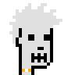
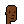
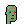
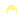
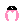
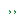
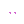
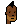

# Let's Go! Programming (Crypto) Pixel Punk Profile Pictures & (Generative) Art with Go - Step-by-Step Book / Guide

_Inside Unique 24×24 Pixel Art on the Blockchain..._

by [Gerald Bauer](https://github.com/geraldb), et al


# 1

## Do-It-Yourself (DIY) - Yes, You Can! - Mint Your Own Punks in Original 24x24 Pixel Format or With 2X / 4X / 8X Zoom


### Step 0 -  Download a punks all-in-one composite image / collection


One time / first time only - Download
a punks pixel art collection
from the
[Awesome 24px Downloads - Free Pixel Art Collections in the 24x24 Format](https://github.com/cryptopunksnotdead/awesome-24px) page.

Let's try the 1000 More Punks
collection
in a single all-in-one 600×960px image (~180 kb) for free.
See  [`morepunks.png` »](https://github.com/cryptopunksnotdead/awesome-24px/blob/master/collection/morepunks.png)


Let's create a program to mint (more) punk pixel art images.
Let's (re)use
the pixelart package
from the [artbase "right-clicker" zero-config web service / server](https://github.com/pixelartexchange/artbase.server).


### Step 1 -  Read punk composite image


``` go
package main


import (
  "fmt"
  "github.com/pixelartexchange/artbase.server/pixelart"
)


func main() {

  fmt.Printf( "Hello, Pixel Art v%s!\n", pixelart.Version )

  path     := "./morepunks.png"
  tileSize := pixelart.Point{24, 24}
  punks    := pixelart.ReadImageComposite( path, &tileSize )

  fmt.Println( punks.Bounds() )
  //=> (0,0)-(600,960)
}
```


### Step 2 - Start minting

Note: By default punks get saved in the original 24x24 pixel format
and the first punk starts at index zero, that is, `0`.
running up to 999.

Let's mint punk #0, #18, #40, and #88.
Add inside `func main()`:


``` go
punk := punks.Tile( 0 )
fmt.Println( punk.Bounds() )
//=> (0,0)-(24,24)

punk.Save( "./morepunk0.png" )


punks.Tile( 18 ).Save( "./morepunk18.png" )
punks.Tile( 40 ).Save( "./morepunk40.png" )
punks.Tile( 88 ).Save( "./morepunk88.png" )
```

And voila!


Let's change the zoom factor:

``` go
punks.Tile( 0 ).Zoom( 4 ).Save( "./morepunk0@4x.png" )
punks.Tile( 18 ).Zoom( 4 ).Save( "./morepunk18@4x.png" )
punks.Tile( 40 ).Zoom( 4 ).Save( "./morepunk40@4x.png" )
punks.Tile( 88 ).Zoom( 4 ).Save( "./morepunk88@4x.png" )
```

And voila in 4x!





Proof-of the pudding.
If you want to run the ready-made sample
program in [**`01_tile/`**](01_tile) yourself try:

- Generate a go module (`go.mod`)
- Add the pixelart package via go get to `go.mod`
- Run the code

```
$ cd 01_tile
$ go mod init example.com/01_title
$ go get github.com/pixelartexchange/artbase.server/pixelart
$ go run main.go
```


Let's try with the classic gray-ish
background in red/green/blue (rgb) as a hexstring `#638596`:


``` go
punks.Tile( 0 ).Background( "#638596" ).Zoom( 4 ).Save( "./morepunk0_(grayish)@4x.png" )
punks.Tile( 18 ).Background( "#638596" ).Zoom( 4 ).Save( "./morepunk18_(grayish)@4x.png" )
punks.Tile( 40 ).Background( "#638596" ).Zoom( 4 ).Save( "./morepunk40_(grayish)@4x.png" )
punks.Tile( 88 ).Background( "#638596" ).Zoom( 4 ).Save( "./morepunk88_(grayish)@4x.png" )
```

And voila!

@4x.png)
@4x.png)
@4x.png)
@4x.png)


Philip! Phree the Phunks!
Let's try to flip vertically, that is, mirror, the punk images - turning right-looking punks into left-looking.


``` go
punks.Tile( 0 ).Background( "#638596" ).Mirror().Zoom( 4 ).Save( "./morephunk0_(grayish)@4x.png" )
punks.Tile( 18 ).Background( "#638596" ).Mirror().Zoom( 4 ).Save( "./morephunk18_(grayish)@4x.png" )
punks.Tile( 40 ).Background( "#638596" ).Mirror().Zoom( 4 ).Save( "./morephunk40_(grayish)@4x.png" )
punks.Tile( 88 ).Background( "#638596" ).Mirror().Zoom( 4 ).Save( "./morephunk88_(grayish)@4x.png" )
```

And voila!

@4x.png)
@4x.png)
@4x.png)
@4x.png)


And so on. Happy miniting.


### Bonus - Glory to Ukraine! Fuck (Vladimir) Putin! Stop the War! - Send A Stop The War Message To The World With Your Profile Picture


Let's try the ukraine flag in the background (with the built-in `Ukraine` helper method):


``` go
punks.Tile( 0 ).Ukraine().Zoom( 4 ).Save( "./morepunk0_flag(ukraine)@4x.png" )
punks.Tile( 18 ).Ukraine().Zoom( 4 ).Save( "./morepunk18_flag(ukraine)@4x.png" )
punks.Tile( 40 ).Ukraine().Zoom( 4 ).Save( "./morepunk40_flag(ukraine)@4x.png" )
punks.Tile( 88 ).Ukraine().Zoom( 4 ).Save( "./morepunk88_flag(ukraine)@4x.png" )
```

And voila!

@4x.png)
@4x.png)
@4x.png)
@4x.png)


Or try two-colored with the background in blue
and the silhouette (foreground) in yellow and vice versa:

``` go
punks.Tile( 0 ).Silhouette("#ffdd00").Background("#0057b7").Zoom( 4 ).Save( "./morepunk0_silhouette(ukraine)@4x.png" )
punks.Tile( 18 ).Silhouette("#0057b7").Background("#ffdd00").Zoom( 4 ).Save( "./morepunk18_silhouette(ukraine)@4x.png" )
punks.Tile( 40 ).Silhouette("#ffdd00").Background("#0057b7").Zoom( 4 ).Save( "./morepunk40_silhouette(ukraine)@4x.png" )
punks.Tile( 88 ).Silhouette("#0057b7").Background("#ffdd00").Zoom( 4 ).Save( "./morepunk88_silhouette(ukraine)@4x.png" )
```

And voila!

@4x.png)
@4x.png)
@4x.png)
@4x.png)


# 2

## 10 000 Punks - The Free Do-It-Yourself (DIY) White Label Quick Starter Edition

> Q: Dear sir, how do I get rich in ~bits-coin~ punks?
>
> A: If we all buy ~bits-coin~ punks from one another
> at ever higher prices we'll all be rich beyond our wildest dreams.
>
> 21 million bits-coin. 10 000 punks. Do the math.


Let's (re)create from zero / scratch a pixel-perfect
copy of the Matt & John's® 10 000 punks collection (Anno 2017).

Yes, you can. Do-it-yourself (DIY) and
own 100% forever your home-made free clean-room copy
of the billion dollar (2400×2400) bitmap
that kicked-off
a trillion dollar get-rich-quick digital art
mania / bubble in 2021 -
selling "decentralized" ~blockchain tokens~
database records
to ever greater fools at ever higher prices.


###  Inside the Magic Money Machine - Mint 10 000 Unique Punks from 11 Archtetypes 'n' 122 Attributes

Let's copy and (re)use all punk (building) blocks
in the basic series (24×24):

11 Archetypes:

Male 1/2/3/4 


,
Female 1/2/3/4 


,
Zombie ,
Ape ,
Alien 

<!-- note:
  sort attributes a-z for now - why? why not?
-->

122 Attributes (by category and a-z):
- Hat -
  Bandana (m/f)
  
  ,
  Beanie (m)
  ,
  Cap (m/f)
  
  ,
  Cap Forward (m)
  ,
  Cowboy Hat (m)
  ,
  Do-rag (m)
  ,
  Fedora (m)
  ,
  Headband (m/f)
  
  ,
  Hoodie (m)
  ,
  Knitted Cap (m/f)
  
  ,
  Pilot Helmet (f)
  ,
  Police Cap (m)
  ,
  Tassle Hat (f)
  ,
  Tiara (f)
  ,
  Top Hat (m)
  
- Hair -
  Blonde Bob (f)
  ,
  Blonde Short (f)
  ,
  Clown Hair Green (m/f)
  
  ,
  Crazy Hair (m/f)
  
  ,
  Dark Hair (f)
  ,
  Frumpy Hair (m/f)
  
  ,
  Half Shaved (f)
  ,
  Messy Hair (m/f)
  
  ,
  Mohawk (m/f)
  
  ,
  Mohawk Dark (m/f)
  
  ,
  Mohawk Thin (m/f)
  
  ,
  Orange Side (f)
  ,
  Peak Spike (m)
  ,
  Pigtails (f)
  ,
  Pink With Hat (f)
  ,
  Purple Hair (m)
  ,
  Red Mohawk (f)
  ,
  Shaved Head (m)
  ,
  Straight Hair (f)
  ,
  Straight Hair Blonde (f)
  ,
  Straight Hair Dark (f)
  ,
  Stringy Hair (m/f)
  
  ,
  Vampire Hair (m)
  ,
  Wild Blonde (f)
  ,
  Wild Hair (m/f)
  
  ,
  Wild White Hair (f)
  
- Eyes -
  3D Glasses (m/f)
   
   ,
  Big Shades (m/f)
  
  ,
  Classic Shades (m/f)
  
  ,
  Eye Mask (m/f)
  
  ,
  Eye Patch (m/f)
  
  ,
  Horned Rim Glasses (m/f)
  
  ,
  Nerd Glasses (m/f)
  
  ,
  Regular Shades (m/f)
  
  ,
  Small Shades (m)
  ,
  VR (m/f)
  
  ,
  Welding Goggles (f)
  
- Eyes (Makeup) -
  Blue Eye Shadow (f)
  ,
  Clown Eyes Blue (m/f)
  
  ,
  Clown Eyes Green (m/f)
  
  ,
  Green Eye Shadow (f)
  ,
  Purple Eye Shadow (f)
  
- Blemishes -
  Mole (m/f)
   
   ,
  Rosy Cheeks (m/f)
   
   ,
  Spots (m/f)
   
   
- Nose -
  Clown Nose (m/f)
   
   ,
- Ears -
  Earring (m/f)
   
   
- Mouth -
  Buck Teeth (m)
   ,
  Frown (m)
   ,
  Smile (m)
   
- Mouth (Makeup) -
  Black Lipstick (f)
   ,
  Hot Lipstick (f)
   ,
  Purple Lipstick (f)
   
- Mouth Prop -
  Cigarette (m/f)
   
   ,
  Medical Mask (m/f)
   
   ,
  Pipe (m/f)
   
   ,
  Vape (m/f)
   
   
- Beard -
  Big Beard (m)
   ,
  Chinstrap (m)
   ,
  Front Beard (m)
   ,
  Front Beard Dark (m)
   ,
  Goat (m)
   ,
  Handlebars (m)
   ,
  Luxurious Beard (m)
   ,
  Mustache (m)
   ,
  Muttonchops (m)
   ,
  Normal Beard (m)
   ,
  Normal Beard Black (m)
   ,
  Shadow Beard (m)
   
- Neck Accessory -
  Choker (f)
   ,
  Gold Chain (m/f)
   
   ,
  Silver Chain (m/f)
   
   


<!-- break -->

(Source: [Punk (Building) Blocks - Basic Series (24×24)](https://github.com/cryptopunksnotdead/punks.blocks#basic-punk-series-2424))


Let's wipe up a `generate_punk`
function that
pastes / composes together
the building blocks / attributes and returns
a ready-to-save image. Example:


``` go
// generate punk #0
punk = generatePunk( "Female 2", "Earring", "Blonde Bob", "Green Eye Shadow" )
punk.Save( "./punk0.png" )
punk.Zoom(20).Save( "./punk0@20x.png" )

// generate punk #1
punk = generatePunk( "Male 1", "Smile", "Mohawk" )
punk.Save( "./punk1.png" )
punk.Zoom(20).Save( "./punk1@20x.png" )
```


Here we go - the billion dollar formula:

``` go
package main


import (
  "fmt"
  "strings"
  "regexp"

  "github.com/pixelartexchange/artbase.server/pixelart"
)

// allow (ignore):
//    space ( ),
//    underscore (_),
//    dash (-)
var normalizeRegexp = regexp.MustCompile( "[ _-]" )

func normalize( str string ) string {
    str = strings.ToLower( str )
    str = normalizeRegexp.ReplaceAllString( str, "" )
    return str
}


var dir = "../basic"

func generatePunk( values ...string ) *pixelart.Image {
  punkType       := values[0]
  attributeNames := values[1:len(values)]

  punkType = normalize( punkType )

  path   :=  dir + "/" + punkType + ".png"
  punk := pixelart.ReadImage( path )

  var m_or_f string
  if strings.Index( punkType, "female" ) != -1 {
    m_or_f = "f"
  } else {
    m_or_f = "m"
  }


  for _, attributeName := range attributeNames {
    if attributeName == "" {   // skip empty attributes
      continue
    }

    attributeName = normalize( attributeName )
    path       = dir + "/" + m_or_f + "/" + attributeName + ".png"
    attribute   := pixelart.ReadImage( path )

    punk.Paste( attribute )
  }

  return punk
}
```


Let's test drive punk #0 and punk 1

``` go
func main() {
  fmt.Printf( "Hello, Pixel Art v%s!\n", pixelart.Version )

  // test drive
  // generate punk #0
  punk := generatePunk( "Female 2", "Earring", "Blonde Bob", "Green Eye Shadow" )
  punk.Save( "punk0.png" )
  punk.Zoom(20).Save( "punk0@20x.png" )

  // generate punk #1
  punk = generatePunk( "Male 1", "Smile", "Mohawk" )
  punk.Save( "punk1.png" )
  punk.Zoom(20).Save( "punk1@20x.png" )
}
```

and voila! In the original 24×24 format:


And 20x (480×480):


Note: If you use your own building blocks
make sure your type and attribute names
match the filenames (without the `.png` extension).
For the matching algorithm all names
get automatically downcased and all spaces deleted,
thus,
`Male 1` will map to `male1.png` 
and `3D Glasses` to `3dglasses.png` 
and `Knitted Cap` to `knittedcap.png` 
and so on.


Let's read-in all meta data records for all 10 000 punks.
See the [punks.csv](punks.csv) dataset that reads:

```
type, attribute1, attribute2, attribute3, attribute4, attribute5, attribute6, attribute7
Female 2, Earring, Blonde Bob, Green Eye Shadow,,,,
Male 1, Smile, Mohawk,,,,,
Female 3, Wild Hair,,,,,,
Male 1, Wild Hair, Pipe, Nerd Glasses,,,,
Male 2, Goat, Earring, Wild Hair, Big Shades,,,
Female 2, Earring, Half Shaved, Purple Eye Shadow,,,,
Male 2, Do-rag,,,,,,
Female 2, Spots, Wild White Hair, Clown Eyes Blue,,,,
Male 1, Luxurious Beard, Messy Hair,,,,,
Male 2, Big Beard, Police Cap, Clown Nose,,,,
Female 1, Mohawk, Blue Eye Shadow,,,,,
Female 2, Black Lipstick, Straight Hair Dark, Clown Eyes Green,,,,
...
```


Let's try:

``` go
recs := readCSV( "../punks.csv" )
fmt.Printf( "%d punk(s)\n", len( recs ) )
//=> 10 000 punk(s)
```


And to wrap up let's loop over all 10 000 punks
and generate a 24×24 version and a 20x zoom, that is,
480×480. Let's go:


``` go
for i,rec := range recs {
    fmt.Printf( "==> %d - %v\n", i, rec )
    punk = generatePunk( rec... )

    name := fmt.Sprintf("punk%d", i )

    punk.Save( "./o/" + name + ".png" )
    punk.Zoom(20).Save( "./o/" + name + "@20x.png" )
}
```

Yes, that's it.
In the `/o` directory you will now find
two images per punk - in the orginal format, that is, 24×24
and 20x, that is, 480×480 - and get:

```
o/
  punk0.png
  punk0@20x.png
  punk1.png
  punk1@20x.png
  punk2.png
  punk2@20x.png
  punk3.png
  punk3@20x.png
  punk4.png
  punk4@20x.png
  punk5.png
  punk5@20x.png
  punk6.png
  punk6@20x.png
  punk7.png
  punk7@20x.png
  punk8.png
  punk8@20x.png
  ...
```

Let's open up the first hundred punks, that is, `punk0.png` to `punk99.png`:





And let's have a looksie at the biggie 20x (480×480) versions:


and so on.


### Bonus -  Generate an All-In-One (2400×2400) Composite Image

Let's generate an all-in-one composite image holding the complete
collection of 10 000 punks in a 100×100 grid.

``` go
punks := pixelart.NewImageComposite( 100, 100,
                                    &pixelart.Point{24, 24})

for i,rec := range recs {
    fmt.Printf( "==> %d - %v\n", i, rec )
    punk = generatePunk( rec... )
    punks.Add( punk )
}

punks.Save( "./o/punks.png" )
```

Yes, that's it.
Open up `punks.png` to have a looksie.


Note: Only showing the first one hundred punks as a preview.
Download [**punks.png**](i/punks.png) ~1MB for the full monty.


To be continued...


## Questions? Comments?

Yes, you can. Post them on the [CryptoPunksDev reddit](https://old.reddit.com/r/CryptoPunksDev). Thanks.


## License


The Programming Punk Step-by-Step book / guide
is dedicated to the public domain.
Use it as you please with no restrictions whatsoever.

